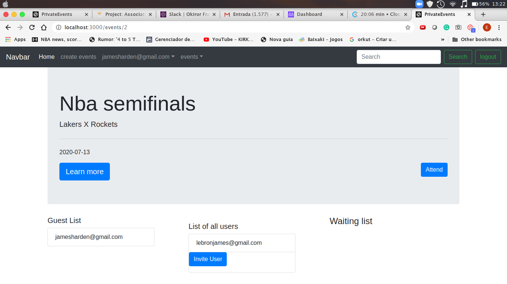
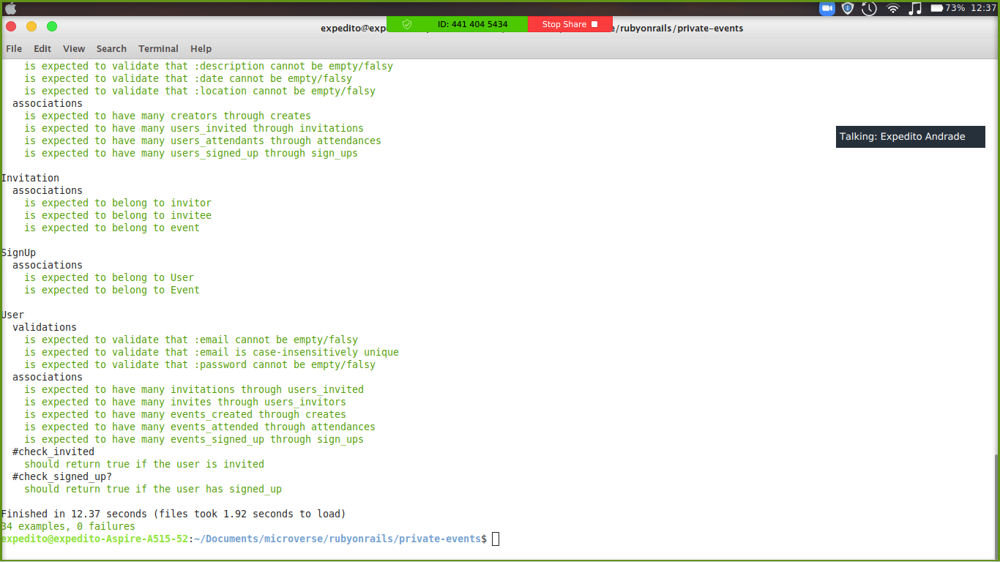

# Private Members

## Description

    We made a small app that mirrors the EventBride, where an user can create events, invite others users and attend to events he was invited for or created by him. The catch is that even if you are not invited for one, you can sign up for the event and the creator can let you attend according to his will.

- Screenshot with logged in user
  
- Screenshot of the tests
  

## Live Demo
[Live Demo Link](https://fast-inlet-47427.herokuapp.com/)

## Built With

- Ruby on Rails
- Rspec
- FactoryBot
- Faker
- Vs Code
- Bootstrap

## Getting Started

To get a local copy up and running follow these simple example steps.

### Prerequisites

- Ruby on Rails

### Usage

- Clone the project to your local machine
- Open your terminal and type in 'rails db:migrate'
- Type 'rails server' on your terminal

## Author

- Okiror Frank
- Expedito Andrade

👤 **Okiror Frank**

- Github: [@frankopkusianwar](https://github.com/frankopkusianwar)
- Twitter: [@franko0781](https://twitter.com/franko0781)
- Linkedin: [Okiror Frank](https://linkedin.com/in/frank-okiror-250076b5)
- Email: okirorfrank3@gmail.com

👤 **Expedito Andrade**

- Github: [@githubexpjazz](https://github.com/expjazz)
- Twitter: [@expjazz](https://twitter.com/expeditoandrade13)
- Linkedin: [Expedito Andrade](https://www.linkedin.com/in/expedito-andrade-3645151a4/)
- Email: expeditojazz@gmail.com

## 🤝 Contributing

Contributions, issues and feature requests are welcome!

Feel free to check the [issues page](issues/).

## Show your support

Give a ⭐️ if you like this project!

## Acknowledgments

- Microverse, standup team and the microverse community for helping build the skills that were used on this project

## 📝 License

This project is [MIT](lic.url) licensed.
